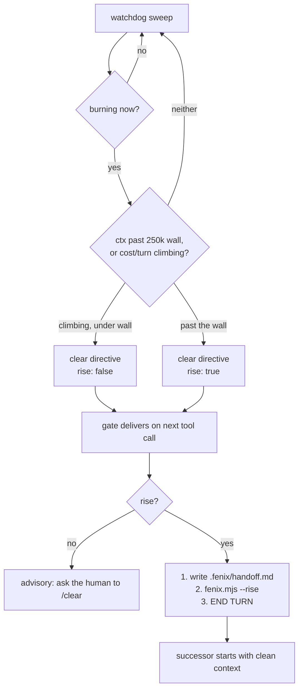

# maxx for agents that manage sessions

For the orchestrator — the agent that spawns, steers, and cleans up after other sessions.
If you only need to gate your own spend, `server/CONNECTOR.md` has the verdict table and
stops there. This is the other half: what maxx knows about sessions that are *not you*, and
what you can do about them.

## The model in one paragraph

Every Claude surface — each laptop, each VM, each cloud routine — ships token counts to one
central tally. A **surface** is one machine or one cloud agent; a **session** is one
conversation on it. The tally holds the whole account's ledger, so the question "can I afford
to fan out right now" has a single answer for the fleet instead of one answer per machine.
The budget is a fixed weekly tank of coins, paced across the 5h windows left in the week.

The critical asymmetry: **a session's cost is not its output.** Every turn re-bills the entire
context. A 600k-context session pays 600k before it does any work, so an idle-looking session
can outspend a busy one by an order of magnitude. Most of what follows exists because of that
one fact.

## The four moves

### 1. Gate — before you spend

Call `maxx_budget` before any fan-out. Plan against `session_to_spend` (the paced, safe
envelope). `session_burst` is the hard 5h ceiling — using it eats future weeks.

Watch `net_per_min`: sustainable pace minus recent burn. Negative means you are spending
faster than the week can sustain, so re-check *between* expensive steps, not once at the top.

The four verdicts (`ok` / `degraded` / `over` / `stale`) are the server's policy — read them,
never re-derive your own staleness rule. See `server/CONNECTOR.md`.

### 2. Reserve — before you fan out

Concurrency breaks the gate. Spawn five agents at once and all five read the same full
allowance, then all five spend it. Call `maxx_reserve` for the tokens the fan-out needs
*first*: an active lease subtracts from the allowance every other caller sees.

The lease has a lifecycle, not just a grant:

- **Release when the fan-out lands.** `maxx_release({ lease_id })` — the spend is already
  in the tally via emits, so an unreleased lease *double-throttles* every other dispatcher
  until its TTL runs out (default 1h, max 6h).
- **Renew instead of stacking.** A run outliving its TTL calls `maxx_reserve` again *with
  its own `lease_id`* — the old lease is replaced (resize/extend), and the old hold does
  not count against the new grant.
- **Bounds.** 100 active leases per handle; total held tokens are capped by the allowance
  itself. A lease throttles `session_to_spend` but never flips the verdict to `over`.

### 3. Steer — while they run

`maxx_directive` addresses a specific session:

| action | effect | delivery |
|---|---|---|
| `clear` | advisory: wind down and clear context | one-shot per session |
| `pause` | denies expensive tools until ttl or resume | sticky, re-delivered |
| `resume` | lifts pauses | — |

Directives reach a session through `gate.mjs`, its PreToolUse hook. Two things follow from
that, and both have bitten:

- **A session with no hook installed cannot be steered.** It will emit its burn and ignore
  every directive you send. Silent, and it looks identical to a compliant session.
- **Delivery rides on tool calls.** Gated tools (`Agent|Task|Workflow|ScheduleWakeup|CronCreate`)
  always poll; every other tool polls at most once a minute per session. A session that only
  edits files still gets its directive — but a session doing nothing at all gets nothing,
  because there is no tool call to attach to.

### 4. Report — after you spend

Call `maxx_emit` at the end of every run with `surface: "cloud:<routine-name>"` and your
output-token count. Leave `anchor` unset — only an interactive Claude Code session can read
`/usage`, so cloud cannot re-anchor and a "re-emit to refresh, then retry" loop is a no-op.

A run that gates but never emits makes the budget read optimistically wrong for every other
agent in the fleet. A *blocked* run emits nothing — that is correct.

## The autonomous loop

Nobody watches the fleet at 3am, so the watchdog acts on its own.

**Two strengths on purpose.** A session merely getting expensive keeps its context — there is
still room to finish the thought, and renewing it throws live state away for nothing. Past the
wall the arithmetic flips: every further turn re-bills everything, so waiting on a human
keystroke is the expensive option.

**Cooldown:** the same session is never nagged more than twice an hour.

## What maxx cannot do

**It cannot press `/clear`.** That is a human keystroke; no hook can send it. A PreToolUse hook
can only inject text. So `rise` hands the session the one sequence it *can* run itself:

1. Write `.fenix/handoff.md` — **the model writes this**, deliberately. Fenix's automatic
   fallback is a raw transcript tail, which is a much worse thing for a successor to wake up to.
2. Run `fenix.mjs --rise` — consumes the handoff and spawns a new `claude` process. A new
   process is a fresh context by construction. Capped by a generation limit (default 5), and it
   *delays* rather than refuses when you are at the spend wall, sleeping until the window refills.
3. **End the turn.** The rise starts a successor; it does not kill its parent. Keep working
   after step 2 and the fat context goes on billing *beside* the new session.

**It cannot re-anchor from the cloud.** Caps are calibrated against Anthropic's own percentages,
readable only from an interactive session's statusline. When every machine sleeps the account
degrades to weekly-only numbers — which still price the tank correctly. Open a session on any
linked machine to re-anchor.

**It cannot see a surface that never emits.** A machine whose config was copied from another
machine reports under the *same* surface id: the burn merges, per-session directives cannot be
addressed, and the fleet looks smaller than it is.

## Failure modes worth knowing

| symptom | cause | fix |
|---|---|---|
| a machine's burn never appears | no emitter, or its config was copied from another machine | install the watcher; `emit.mjs` re-stamps a copied config with a fresh install id |
| directives queue but never deliver | no `gate.mjs` PreToolUse hook on that box | wire the hook; use an absolute node path — hooks run in a non-login shell |
| the fleet overspends despite gating | concurrent spawns each read the full allowance | `maxx_reserve` before the fan-out |
| `session_to_spend` stuck low after a fan-out ended | lease never released — still throttling until TTL | `maxx_release` when the fan-out lands |
| verdict flips to `stale`, everything blocks | no machine has read `/usage` in over 12h | open an interactive session on any linked machine |
| budget reads richer than reality | a run gated but never emitted | always `maxx_emit` at the end of a run |

## Reference

| thing | value | where |
|---|---|---|
| context wall | 250k | `server/tally.mjs` `CTX_WALL` |
| watchdog cooldown | 30 min/session | `server/tally.mjs` `WATCH_COOLDOWN` |
| directive poll, ungated tools | 60s per session | `maxx/gate.mjs` `POLL_EVERY_SEC` |
| budget cache reused without a call | 60s | `maxx/gate.mjs` `CACHE_FRESH_SEC` |
| cached verdict trusted while server is down | 600s, then fail-closed | `maxx/gate.mjs` `CACHE_GRACE_SEC` |
| rise generation cap | 5 (`MAXX_RISE_MAX_GEN`) | `maxx/fenix.mjs` |

Related: `server/CONNECTOR.md` (deploy, verdicts, install) · `maxx/SKILL.md` (per-session use) ·
`maxx/FENIX-SKILL.md` (handoff format).
